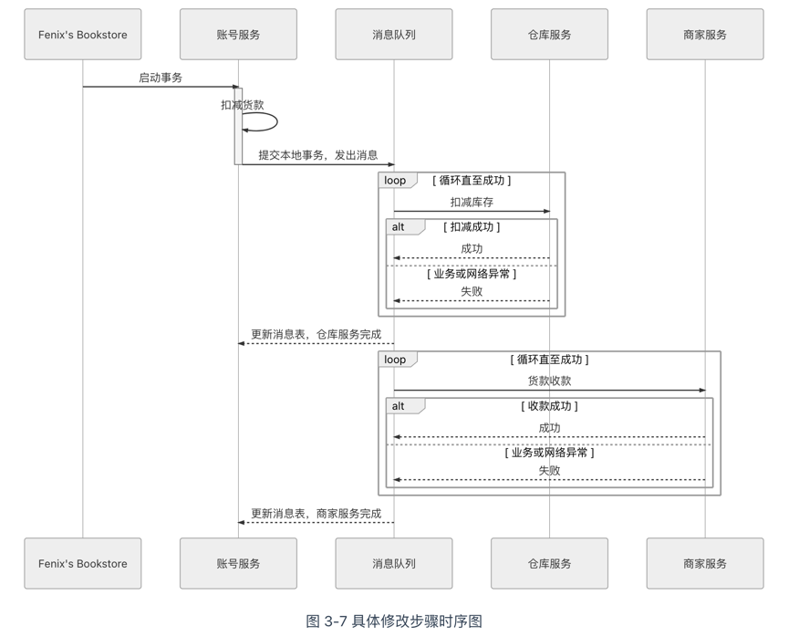
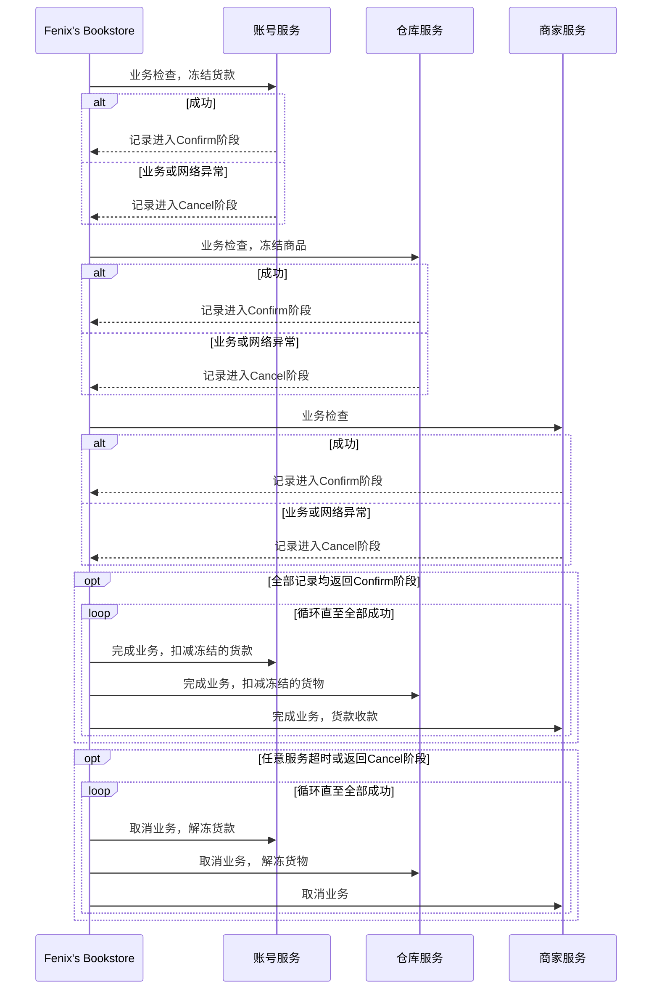
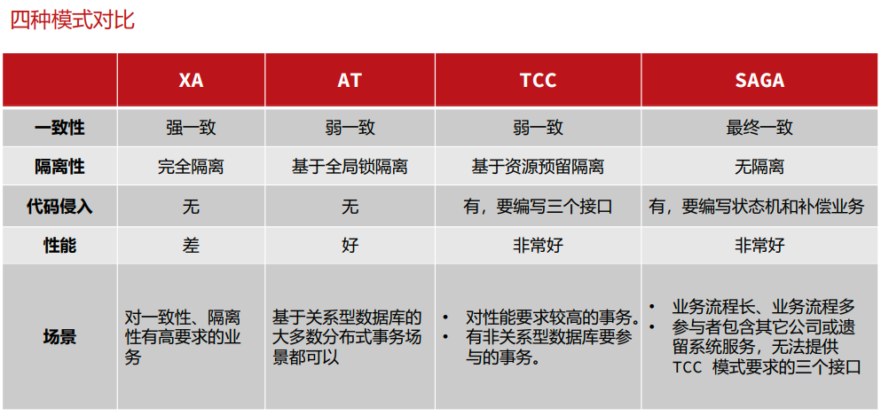

# 分布式事务

分布式事务”中，目标同样也不得不从之前三种事务模式追求的强一致性，降低为追求获得“最终一致性”。由于一致性的定义变动，“事务”一词的含义其实也同样被拓展了，人们把使用 ACID 的事务称为“刚性事务”，而把笔者下面将要介绍几种分布式事务的常见做法统称为“柔性事务”。

## 可靠事件队列
Dan Pritchett 提出的“可靠事件队列”的具体做法，目标仍然是交易过程中正确修改账号、仓库和商家服务中的数据，如下图 : 



流程 : 
1. 用户向 Fenix's Bookstore 发送交易请求：购买一本书
2. 应对用户账号扣款、商家账号收款、库存商品出库这三个操作有一个出错概率的先验评估，根据出错概率的大小来安排它们的操作顺序==账号扣款 → 仓库出库 → 商家收款。
3. 账号服务进行扣款业务，如扣款成功，则在自己的数据库建立一张消息表，里面存入一条消息,包括字段: 事务ID, 扣款状态,仓库出库状态,收款状态
4. 建立一个消息服务，定时轮询消息表，将状态是“进行中”的消息同时发送到库存和商家服务节点

由此可见 : 

可靠事件队列只要第一步业务完成了，后续就没有失败回滚的概念，只许成功，不许失败。
支持分布式事务的消息框架，如 RocketMQ，原生就支持分布式事务操作，


靠着持续重试来保证可靠性的解决方案谈不上是 Dan Pritchett 的首创或者独创，它在计算机的其他领域中已被频繁使用，也有了专门的名字叫作**“最大努力交付”**（Best-Effort Delivery），譬如 TCP 协议中未收到 ACK 应答自动重新发包的可靠性保障就属于最大努力交付。而可靠事件队列还有一种更普通的形式，被称为“最大努力一次提交”（Best-Effort 1PC），指的就是将最有可能出错的业务以本地事务的方式完成后，采用不断重试的方式（不限于消息系统）来促使同一个分布式事务中的其他关联业务全部完成。

`问题 : 缺乏隔离性,会导致超售等问题, 可以考虑TCC`

## TCC

可靠消息队列虽然能保证最终的结果是相对可靠的，过程也足够简单（相对于 TCC 来说），但整个过程完全没有任何隔离性可言，有一些业务中隔离性是无关紧要的，但有一些业务中缺乏隔离性就会带来许多麻烦

上面例子里面缺乏隔离性,会导致超卖的问题,

如果业务需要隔离，那架构师通常就应该重点考虑 TCC 方案，该方案天生适合用于需要强隔离性的分布式事务中。

TCC 较为烦琐，它是一种业务侵入式较强的事务方案，要求业务处理过程必须拆分为“预留业务资源”和“确认/释放消费资源”两个子过程。如同 TCC 的名字所示，它分为以下三个阶段。
```agsl
Try ：尝试执行阶段，完成所有业务可执行性的检查（保障一致性），并且预留好全部需用到的业务资源（保障隔离性）。
Confirm：确认执行阶段，不进行任何业务检查，直接使用 Try 阶段准备的资源来完成业务处理。Confirm 阶段可能会重复执行，因此本阶段所执行的操作需要具备幂等性。
Cancel：取消执行阶段，释放 Try 阶段预留的业务资源。Cancel 阶段可能会重复执行，也需要满足幂等性。
```



由上述操作过程可见，TCC 其实有点类似 2PC 的准备阶段和提交阶段，但 TCC 是位于用户代码层面，而不是在基础设施层面，这为它的实现带来了较高的灵活性，可以根据需要设计资源锁定的粒度。TCC 在业务执行时只操作预留资源，几乎不会涉及锁和资源的争用，具有很高的性能潜力。但是 TCC 并非纯粹只有好处，它也带来了更高的开发成本和业务侵入性，意味着有更高的开发成本和更换事务实现方案的替换成本，所以，通常我们并不会完全靠裸编码来实现 TCC，而是基于某些分布式事务中间件（譬如阿里开源的Seata）去完成，尽量减轻一些编码工作量。

`
问题是 :  对代码业务侵入比较强,如果是其他的支付系统,你改造不了代码.
解决方案 : 使用SAGA`

## SAGA

TCC 事务具有较强的隔离性，避免了“超售”的问题，而且其性能一般来说是本篇提及的几种柔性事务模式中最高的，但它仍不能满足所有的场景。TCC 的最主要限制是它的业务侵入性很强，这里并不是重复上一节提到的它需要开发编码配合所带来的工作量，而更多的是指它所要求的技术可控性上的约束。譬如，把我们的场景事例修改如下：由于中国网络支付日益盛行，现在用户和商家在书店系统中可以选择不再开设充值账号，至少不会强求一定要先从银行充值到系统中才能进行消费，允许直接在购物时通过 U 盾或扫码支付，在银行账号中划转货款。这个需求完全符合国内网络支付盛行的现状，却给系统的事务设计增加了额外的限制：如果用户、商家的账号余额由银行管理的话，其操作权限和数据结构就不可能再随心所欲的地自行定义，通常也就无法完成冻结款项、解冻、扣减这样的操作，因为银行一般不会配合你的操作。所以 TCC 中的第一步 Try 阶段往往无法施行。我们只能考虑采用另外一种柔性事务方案：SAGA 事务。SAGA 在英文中是“长篇故事、长篇记叙、一长串事件”的意思。

Saga的核心是补偿，与TCC不同的是Saga不需要Try，而是直接进行confirm、cancel操作。
```agsl
Confirm：依次按顺序依次执行资源操作，各个资源直接处理本地事务，如无问题，二阶段什么都不用做；
Cancel：异常情况下需要调用的补偿事务（逆操作）来保证数据的一致性。
```

SAGA 必须保证所有子事务都得以提交或者补偿，但 SAGA 系统本身也有可能会崩溃，所以它必须设计成与数据库类似的日志机制（被称为 SAGA Log）以保证系统恢复后可以追踪到子事务的执行情况，譬如执行至哪一步或者补偿至哪一步了。另外，尽管补偿操作通常比冻结/撤销容易实现，但保证正向、反向恢复过程的能严谨地进行也需要花费不少的工夫，譬如通过服务编排、可靠事件队列等方式完成，所以，SAGA 事务通常也不会直接靠裸编码来实现，一般也是在事务中间件的基础上完成，前面提到的 Seata 就同样支持 SAGA 事务模式。


## AT
`基于数据补偿来代替回滚的思路`，还可以应用在其他事务方案上。举个具体例子，譬如阿里的 GTS（Global Transaction Service，Seata 由 GTS 开源而来）所提出的“AT 事务模式”就是这样的一种应用。


AT 事务是参照了 XA 两段提交协议实现的，但针对 XA 2PC 的缺陷，即在准备阶段必须等待所有数据源都返回成功后，协调者才能统一发出 Commit 命令而导致的木桶效应（所有涉及的锁和资源都需要等待到最慢的事务完成后才能统一释放），设计了针对性的解决方案。大致的做法是在`业务数据提交时自动拦截所有 SQL，将 SQL 对数据修改前、修改后的结果分别保存快照，生成行锁，通过本地事务一起提交到操作的数据源中，相当于自动记录了重做和回滚日志`。如果分布式事务成功提交，那后续清理每个数据源中对应的日志数据即可；如果分布式事务需要回滚，就根据日志数据自动产生用于补偿的“逆向 SQL”。基于这种补偿方式，分布式事务中所涉及的每一个数据源都可以单独提交，然后立刻释放锁和资源。

因为在缺乏隔离性的前提下，以补偿代替回滚并不一定是总能成功的。譬如，当本地事务提交之后、`分布式事务完成之前，该数据被补偿之前又被其他操作修改过，即出现了脏写（Dirty Write）`，这时候一旦出现分布式事务需要回滚，就不可能再通过自动的逆向 SQL 来实现补偿，只能由人工介入处理了。

通常来说，脏写是一定要避免的，所有传统关系数据库在最低的隔离级别上都仍然要加锁以避免脏写，`因为脏写情况一旦发生，人工其实也很难进行有效处理。所以 GTS 增加了一个“全局锁”（Global Lock）的机制来实现写隔离`，要求本地事务提交之前，一定要先拿到针对修改记录的全局锁后才允许提交，没有获得全局锁之前就必须一直等待，这种设计以牺牲一定性能为代价，避免了有两个分布式事务中包含的本地事务修改了同一个数据，从而避免脏写。


## 总结 :


基于XA的 JTA , 2PC , 3PC 其实都是强一致性来实现的, 
而 TCC(设置冻结状态和撤销冻结) , AT(回滚阶段 通过之前的逆向SQl来进行补偿) ,SAGA(补偿操作来替代冻结操作) 都是基于补偿机制来实现