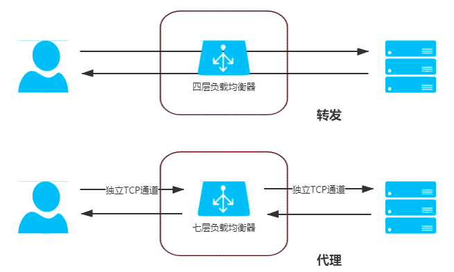

# 客户端缓存

## 强制缓存
HTTP 协议中设有以下两类 Header 实现强制缓存。

+ Expires：Expires 是 HTTP/1.0 协议中开始提供的 Header，后面跟随一个截至时间参数。当服务器返回某个资源时带有该 Header 的话，意味着服务器承诺截止时间之前资源不会发生变动，浏览器可直接缓存该数据，不再重新发请求，示例：

```agsl
HTTP/1.1 200 OK
Expires: Wed, 8 Apr 2020 07:28:00 GMT
```
+ Cache-Control：Cache-Control 是 HTTP/1.1 协议中定义的强制缓存 Header，它的语义比起 Expires 来说就丰富了很多，如果 Cache-Control 和 Expires 同时存在，并且语义存在冲突（譬如 Expires 与 max-age / s-maxage 冲突）的话，规定必须以 Cache-Control 为准。Cache-Control 的使用示例如下：
```agsl
HTTP/1.1 200 OK
Cache-Control: max-age=600
```


## 协商缓存
强制缓存是基于时效性的，但无论是人还是服务器，其实多数情况下都并没有什么把握去承诺某项资源多久不会发生变化。另外一种基于变化检测的缓存机制，在一致性上会有比强制缓存更好的表现，但需要一次变化检测的交互开销，性能上就会略差一些，这种基于检测的缓存机制，通常被称为“协商缓存”。另外，应注意在 HTTP 中协商缓存与强制缓存并没有互斥性，这两套机制是并行工作的，譬如，当强制缓存存在时，直接从强制缓存中返回资源，无须进行变动检查；而当强制缓存超过时效，或者被禁止（no-cache / must-revalidate），协商缓存仍可以正常地工作。协商缓存有两种变动检查机制，分别是根据资源的修改时间进行检查，以及根据资源唯一标识是否发生变化来进行检查，它们都是靠一组成对出现的请求、响应 Header 来实现的：

Last-Modified 和 If-Modified-Since：Last-Modified 是服务器的响应 Header，用于告诉客户端这个资源的最后修改时间。对于带有这个 Header 的资源，当客户端需要再次请求时，会通过 If-Modified-Since 把之前收到的资源最后修改时间发送回服务端。

# 域名解析

DNS 的作用是将便于人类理解的域名地址转换为便于计算机处理的 IP 地址

DNS 解析步骤：

1. 客户端先检查本地的 DNS 缓存，查看是否存在并且是存活着的该域名的地址记录。DNS 是以存活时间（Time to Live，TTL）来衡量缓存的有效情况的，所以，如果某个域名改变了 IP 地址，DNS 服务器并没有任何机制去通知缓存了该地址的机器去更新或者失效掉缓存，只能依靠 TTL 超期后的重新获取来保证一致性。后续每一级 DNS 查询的过程都会有类似的缓存查询操作
2. 客户端将地址发送给本机操作系统中配置的本地 DNS（Local DNS）
3. 本地 DNS 收到查询请求后，会按照“是否有www.icyfenix.com.cn的权威服务器”→“是否有icyfenix.com.cn的权威服务器”→“是否有com.cn的权威服务器”→“是否有cn的权威服务器”的顺序，依次查询自己的地址记录，如果都没有查询到，就会一直找到最后点号代表的根域名服务器为止。

智能DNS :
可以根据用户的来路，自动智能化判断来路IP返回给用户，而不需要用户进行选择。
选择距离用户最近的一个IP地址或者最近的机房来

# 传输链路

## 连接数优化

我们知道 HTTP（特指 HTTP/3 以前）是以 TCP 为传输层的应用层协议，但 HTTP over TCP 这种搭配只能说是 TCP 在当今网络中统治性地位所造就的结果，
回想一下你上网平均每个页面停留的时间，以及每个页面中包含的资源（HTML、JS、CSS、图片等）数量，可以总结出 HTTP 传输对象的主要特征是数量多、时间短、资源小、切换快。另一方面，TCP 协议要求必须在三次握手完成之后才能开始数据传输，这是一个可能高达“百毫秒”为计时尺度的事件；另外，TCP 还有慢启动的特性，使得刚刚建立连接时传输速度是最低的，后面再逐步加速直至稳定。由于 TCP 协议本身是面向于长时间、大数据传输来设计的，在长时间尺度下，它连接建立的高昂成本才不至于成为瓶颈，

它的稳定性和可靠性的优势才能展现出来。因此，可以说 HTTP over TCP 这种搭配在目标特征上确实是有矛盾的，

`http over tcp在15个并发情况下会明显的下降趋势`


队首阻塞问题一直持续到第二代的 HTTP 协议，即 HTTP/2 发布后才算是被比较完美地解决。在 HTTP/1.x 中，HTTP 请求就是传输过程中最小粒度的信息单位了，所以如果将多个请求切碎，再混杂在一块传输，客户端势必难以分辨重组出有效信息。而在 HTTP/2 中，帧（Frame）才是最小粒度的信息单位，它可以用来描述各种数据，譬如请求的 Headers、Body，或者用来做控制标识，譬如打开流、关闭流。这里说的流（Stream）是一个逻辑上的数据通道概念，每个帧都附带一个流 ID 以标识这个帧属于哪个流。这样，在同一个 TCP 连接中传输的多个数据帧就可以根据流 ID 轻易区分出开来，在客户端毫不费力地将不同流中的数据重组出不同 HTTP 请求和响应报文来。这项设计是 HTTP/2 的最重要的技术特征一，被称为 HTTP/2 多路复用（HTTP/2 Multiplexing）技术，如图 4-4 所示。

## 传输压缩
如何不以断开 TCP 连接为标志来判断资源已传输完毕。  (待补充)
```agsl
查看响应头中的 Content-Length 字段：HTTP/2 响应头中包含了 Content-Length 字段，表示资源的大小。如果 Content-Length 字段的值与实际传输的资源大小相同，则可以判断资源已传输完毕。
查看响应头中的 Transfer-Encoding 字段：HTTP/2 响应头中还可能包含 Transfer-Encoding 字段，表示传输编码方式。如果 Transfer-Encoding 字段的值为 chunked，则表示资源被分块传输。在分块传输中，每个分块都包含了一个十六进制的长度值，表示该分块的大小。当收到最后一个分块后，资源即已传输完毕。
使用数据流的控制机制：HTTP/2 支持数据流的控制机制，可以通过数据流的优先级、流量控制和流控制窗口等机制来判断资源是否已传输完毕。当数据流的控制窗口变为零时，表示资源已传输完毕。
传输完成标志：在HTTP/2帧头部中，有一个称为PRIORITY的标志，如果该标志的值为1，则表示该帧是最后一帧，资源传输已完成。这可以用于确认资源的结束
```

## 快速 UDP 网络连接
HTTP 是应用层协议而不是传输层协议，它的设计原本并不应该过多地考虑底层的传输细节，从职责上讲，持久连接、多路复用、分块编码这些能力，已经或多或少超过了应用层的范畴。要从根本上改进 HTTP，必须直接替换掉 HTTP over TCP 的根基，即 TCP 传输协议，这便最新一代 HTTP/3 协议的设计重点

QUIC 会以 UDP 协议为基础，而 UDP 协议没有丢包自动重传的特性，因此 QUIC 的可靠传输能力并不是由底层协议提供，而是完全由自己来实现。由 QUIC 自己实现的好处是能对每个流能做单独的控制，如果在一个流中发生错误，协议栈仍然可以独立地继续为其他流提供服务。这对提高易出错链路的性能非常有用，因为在大多数情况下，TCP 协议接到数据包丢失或损坏通知之前，可能已经收到了大量的正确数据，但是在纠正错误之前，其他的正常请求都会等待甚至被重发，这也是在连接数优化一节中，笔者提到 HTTP/2 未能解决传输大文件慢的根本原因。

# 内容分发网络(cdn)

## 路由解析
根据我们对 DNS 域名解析的了解，一次没有内容分发网络参与的用户访问，其解析过程如图 4-5 所示。

  -浏览器，本地DNS，域名权威DNS，源站服务器


>图 4-5 没有内容分发网络参与的用户访问的解析过程

那么有内容分发网络参与的用户访问如下 , 

  -浏览器，本地DNS，域名权威DNS， CNAME权威DNS，CDN服务器，源站服务器  


>图 4-6 CDN 路由解析


## 内容分发
在 DNS 服务器的协助下，无论是对用户还是服务器，内容分发网络都可以是完全透明的，在两者都不知情的情况下，由 CDN 的缓存节点接管了用户向服务器发出的资源请求。后面随之而来的问题是缓存节点中必须有用户想要请求的资源副本，才可能代替源站来响应用户请求。这里面又包括了两个子问题：“如何获取源站资源”和“如何管理（更新）资源”。

### 主动分发
分发由源站主动发起，将内容从源站或者其他资源库推送到用户边缘的各个 CDN 缓存节点上。这个推送的操作没有什么业界标准可循，可以采用任何传输方式（HTTP、FTP、P2P，等等）、任何推送策略（满足特定条件、定时、人工，等等）、任何推送时间，只要与后面说的更新策略相匹配即可。由于主动分发通常需要源站、CDN 服务双方提供程序 API 接口层面的配合，所以它对源站并不是透明的，只对用户一侧单向透明。主动分发一般用于网站要预载大量资源的场景。譬如双十一之前一段时间内，淘宝、京东等各个网络商城就会开始把未来活动中所需用到的资源推送到 CDN 缓存节点中，特别常用的资源甚至会直接缓存到你的手机 APP 的存储空间或者浏览器的localStorage上。
### 被动分发
被动回源由用户访问所触发全自动、双向透明的资源缓存过程。当某个资源首次被用户请求的时候，CDN 缓存节点发现自己没有该资源，就会实时从源站中获取，这时资源的响应时间可粗略认为是资源从源站到 CDN 缓存节点的时间，再加上资源从 CDN 发送到用户的时间之和。因此，被动回源的首次访问通常是比较慢的（但由于 CDN 的网络条件一般远高于普通用户，并不一定就会比用户直接访问源站更慢），不适合应用于数据量较大的资源。被动回源的优点是可以做到完全的双向透明，不需要源站在程序上做任何的配合，使用起来非常方便。这种分发方式是小型站点使用 CDN 服务的主流选择，如果不是自建 CDN，而是购买阿里云、腾讯云的 CDN 服务的站点，多数采用的就是这种方式。

## CDN应用  

内容分发网络最初是为了快速分发静态资源而设计的，但今天的 CDN 所能做的事情已经远远超越了开始建设时的目标，这部分应用太多，

+ 加速静态资源：这是 CDN 本职工作。
+ 安全防御：CDN 在广义上可以视作网站的堡垒机，源站只对 CDN 提供服务，由 CDN 来对外界其他用户服务，这样恶意攻击者就不容易直接威胁源站。CDN 对某些攻击手段的防御，如对DDoS 攻击的防御尤其有效。但需注意，将安全都寄托在 CDN 上本身是不安全的，一旦源站真实 IP 被泄漏，就会面临很高的风险。
+ 协议升级：不少 CDN 提供商都同时对接（代售 CA 的）SSL 证书服务，可以实现源站是 HTTP 协议的，而对外开放的网站是基于 HTTPS 的。同理，可以实现源站到 CDN 是 HTTP/1.x 协议，CDN 提供的外部服务是 HTTP/2 或 HTTP/3 协议、实现源站是基于 IPv4 网络的，CDN 提供的外部服务支持 IPv6 网络，等等。
+ 状态缓存：第一节介绍客户端缓存时简要提到了状态缓存，CDN 不仅可以缓存源站的资源，还可以缓存源站的状态，譬如源站的 301/302 转向就可以缓存起来让客户端直接跳转、还可以通过 CDN 开启HSTS、可以通过 CDN 进行OCSP 装订加速 SSL 证书访问，等等。有一些情况下甚至可以配置 CDN 对任意状态码（譬如 404）进行一定时间的缓存，以减轻源站压力，但这个操作应当慎重，在网站状态发生改变时去及时刷新缓存。
+ 修改资源：CDN 可以在返回资源给用户的时候修改它的任何内容，以实现不同的目的。譬如，可以对源站未压缩的资源自动压缩并修改 Content-Encoding，以节省用户的网络带宽消耗、可以对源站未启用客户端缓存的内容加上缓存 Header，自动启用客户端缓存，可以修改CORS的相关 Header，将源站不支持跨

# 负载均衡

我们所讨论的“负载均衡”就只聚焦于网络请求进入数据中心入口之后的其他级次的负载均衡。

无论在网关内部建立了多少级的负载均衡，从形式上来说都可以分为两种：四层负载均衡和七层负载均衡。在详细介绍它们是什么以及如何工作之前，我们先来建立两个总体的、概念性的印象。

+ 四层负载均衡的优势是性能高，七层负载均衡的优势是功能强。
+ 做多级混合负载均衡，通常应是低层的负载均衡在前，高层的负载均衡在后

## 数据链路层负载均衡
“MAC 目标地址”和“MAC 源地址”两项即可。我们知道每一块网卡都有独立的 MAC 地址，以太帧上这两个地址告诉了交换机，此帧应该是从连接在交换机上的哪个端口的网卡发出，送至哪块网卡的。

数据链路层负载均衡所做的工作，是修改请求的数据帧中的 MAC 目标地址，让用户原本是发送给负载均衡器的请求的数据帧，被二层交换机根据新的 MAC 目标地址转发到服务器集群中对应的服务器（后文称为“真实服务器”，Real Server）的网卡上，这样真实服务器就获得了一个原本目标并不是发送给它的数据帧。

虽然数据链路层负载均衡效率很高，但它并不能适用于所有的场合，除了那些需要感知应用层协议信息的负载均衡场景它无法胜任外（所有的四层负载均衡器都无法胜任，将在后续介绍七层均衡器时一并解释），它在网络一侧受到的约束也很大。二层负载均衡器直接改写目标 MAC 地址的工作原理决定了它与真实的服务器的通信必须是二层可达的，通俗地说就是必须位于同一个子网当中，无法跨 VLAN。优势（效率高）和劣势（不能跨子网）共同决定了数据链路层负载均衡最适合用来做数据中心的第一级均衡设备，用来连接其他的下级负载均衡器。

## 网络层负载均衡
根据 OSI 七层模型，在第三层网络层传输的单位是分组数据包（Packets），这是一种在分组交换网络（Packet Switching Network，PSN）中传输的结构化数据单位。以 IP 协议为例，一个 IP 数据包由 Headers 和 Payload 两部分组成， Headers 长度最大为 60 Bytes，其中包括了 20 Bytes 的固定数据和最长不超过 40 Bytes 的可选的额外设置组成。

只要知道在 IP 分组数据包的 Headers 带有源和目标的 IP 地址即可。源和目标 IP 地址代表了数据是从分组交换网络中哪台机器发送到哪台机器的，我们可以沿用与二层改写 MAC 地址相似的思路，通过改变这里面的 IP 地址来实现数据包的转发。具体有两种常见的修改方式。

由于 IP 隧道工作在网络层，所以可以跨越 VLAN，因此摆脱了直接路由模式中网络侧的约束。此模式从请求到响应的过程如图 4-9 所示。


处理似曾相识，这不就是在家里、公司、学校上网时，由一台路由器带着一群内网机器上网的“网络地址转换”（Network Address Translation，NAT）操作吗？这种负载均衡的模式的确被称为 NAT 模式，此时，负载均衡器就是充当了家里、公司、学校的上网路由器的作用。NAT 模式的负载均衡器运维起来十分简单，只要机器将自己的网关地址设置为均衡器地址，就无须再进行任何额外设置了。

## 应用层负载均衡
前面介绍的四层负载均衡工作模式都属于“转发”，即直接将承载着 TCP 报文的底层数据格式（IP 数据包或以太网帧）转发到真实服务器上，此时客户端到响应请求的真实服务器维持着同一条 TCP 通道。但工作在四层之后的负载均衡模式就无法再进行转发了，只能进行代理，此时真实服务器、负载均衡器、客户端三者之间由两条独立的 TCP 通道来维持通信，转发与代理的区别如图 4-11 所示。



七层负载均衡器它就属于反向代理中的一种，如果只论网络性能，七层均衡器肯定是无论如何比不过四层均衡器的，它比四层均衡器至少多一轮 TCP 握手，有着跟 NAT 转发模式一样的带宽问题，而且通常要耗费更多的 CPU，因为可用的解析规则远比四层丰富。所以如果用七层均衡器去做下载站、视频站这种流量应用是不合适的，起码不能作为第一级均衡器。但是，如果网站的性能瓶颈并不在于网络性能，要论整个服务集群对外所体现出来的服务性能，七层均衡器就有它的用武之地了。这里面七层均衡器的底气就是来源于它工作在应用层，可以感知应用层通信的具体内容，往往能够做出更明智的决策，玩出更多的花样来。


## 均衡策略与实现
代理的工作模式相信大家应该是比较熟悉的，这里不再展开，只是简单列举了一些七层代理可以实现的功能

前面介绍 CDN 应用时，所有 CDN 可以做的缓存方面的工作（就是除去 CDN 根据物理位置就近返回这种优化链路的工作外），七层均衡器全都可以实现，譬如静态资源缓存、协议升级、安全防护、访问控制，等等。
七层均衡器可以实现更智能化的路由。譬如，根据 Session 路由，以实现亲和性的集群；根据 URL 路由，实现专职化服务（此时就相当于网关的职责）；甚至根据用户身份路由，实现对部分用户的特殊服务（如某些站点的贵宾服务器），等等。
某些安全攻击可以由七层均衡器来抵御，譬如一种常见的 DDoS 手段是 SYN Flood 攻击，即攻击者控制众多客户端，使用虚假 IP 地址对同一目标大量发送 SYN 报文。从技术原理上看，由于四层均衡器无法感知上层协议的内容，这些 SYN 攻击都会被转发到后端的真实服务器上；而七层均衡器下这些 SYN 攻击自然在负载均衡设备上就被过滤掉，不会影响到后面服务器的正常运行。类似地，可以在七层均衡器上设定多种策略，譬如过滤特定报文，以防御如 SQL 注入等应用层面的特定攻击手段。
很多微服务架构的系统中，链路治理措施都需要在七层中进行，譬如服务降级、熔断、异常注入，等等。譬如，一台服务器只有出现物理层面或者系统层面的故障，导致无法应答 TCP 请求才能被四层均衡器所感知，进而剔除出服务集群，如果一台服务器能够应答，只是一直在报 500 错，那四层均衡器对此是完全无能为力的，只能由七层均衡器来解决。

负载均衡的两大职责是“选择谁来处理用户请求”和“将用户请求转发过去”。到此我们仅介绍了后者，即请求的转发或代理过程。前者是指均衡器所采取的均衡策略，由于这一块涉及的均衡算法太多，笔者无法逐一展开，所以本节仅从功能和应用的角度去介绍一些常见的均衡策略。

轮循均衡（Round Robin）：每一次来自网络的请求轮流分配给内部中的服务器，从 1 至 N 然后重新开始。此种均衡算法适合于集群中的所有服务器都有相同的软硬件配置并且平均服务请求相对均衡的情况。
权重轮循均衡（Weighted Round Robin）：根据服务器的不同处理能力，给每个服务器分配不同的权值，使其能够接受相应权值数的服务请求。譬如：服务器 A 的权值被设计成 1，B 的权值是 3，C 的权值是 6，则服务器 A、B、C 将分别接收到 10%、30％、60％的服务请求。此种均衡算法能确保高性能的服务器得到更多的使用率，避免低性能的服务器负载过重。
随机均衡（Random）：把来自客户端的请求随机分配给内部中的多个服务器，在数据足够大的场景下能达到相对均衡的分布。
权重随机均衡（Weighted Random）：此种均衡算法类似于权重轮循算法，不过在分配处理请求时是个随机选择的过程。
一致性哈希均衡（Consistency Hash）：根据请求中某一些数据（可以是 MAC、IP 地址，也可以是更上层协议中的某些参数信息）作为特征值来计算需要落在的节点上，算法一般会保证同一个特征值每次都一定落在相同的服务器上。一致性的意思是保证当服务集群某个真实服务器出现故障，只影响该服务器的哈希，而不会导致整个服务集群的哈希键值重新分布。
响应速度均衡（Response Time）：负载均衡设备对内部各服务器发出一个探测请求（例如 Ping），然后根据内部中各服务器对探测请求的最快响应时间来决定哪一台服务器来响应客户端的服务请求。此种均衡算法能较好的反映服务器的当前运行状态，但这最快响应时间仅仅指的是负载均衡设备与服务器间的最快响应时间，而不是客户端与服务器间的最快响应时间。
最少连接数均衡（Least Connection）：客户端的每一次请求服务在服务器停留的时间可能会有较大的差异，随着工作时间加长，如果采用简单的轮循或随机均衡算法，每一台服务器上的连接进程可能会产生极大的不平衡，并没有达到真正的负载均衡。最少连接数均衡算法对内部中需负载的每一台服务器都有一个数据记录，记录当前该服务器正在处理的连接数量，当有新的服务连接请求时，将把当前请求分配给连接数最少的服务器，使均衡更加符合实际情况，负载更加均衡。此种均衡策略适合长时处理的请求服务，如 FTP 传输。
…………
从实现角度来看，负载均衡器的实现分为“软件均衡器”和“硬件均衡器”两类。在软件均衡器方面，又分为直接建设在操作系统内核的均衡器和应用程序形式的均衡器两种。前者的代表是 LVS（Linux Virtual Server），后者的代表有 Nginx、HAProxy、KeepAlived 等，前者性能会更好，因为无须在内核空间和应用空间中来回复制数据包；而后者的优势是选择广泛，使用方便，功能不受限于内核版本。

在硬件均衡器方面，往往会直接采用应用专用集成电路（Application Specific Integrated Circuit，ASIC）来实现，有专用处理芯片的支持，避免操作系统层面的损耗，得以达到最高的性能。这类的代表就是著名的 F5 和 A10 公司的负载均衡产品。


