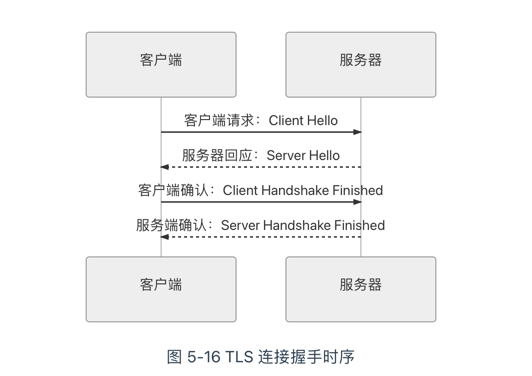

# 架构安全性-数字证书

上个文字已经简单说了一些基本的概念，包括RBAC，和Oauth2等等，因为本身对这里已经比较熟悉，所以目前先不写这块的内容，特意写一下数字证书的工作原理。

当我们无法用“签名”手段来达成信任，那么我们用什么渠道，不妨想想在现实世界我们如何达成信任，不外乎于两种 ： 

+ 基于共同私密信息的信任。 （询问一些只有两个人才知道的私密信息）
+ 基于权威公证人的信任。 （去一趟公安局，让警察帮你查查是不是诈骗）

在网络世界里面，授权服务器和资源服务器大概率是不认识的，所以我们采用的就是标准是 公开密钥基础设施（public key infrastructure ，PKI）

那么也引出了，我们本节的主角 ：  证书，证书是权威CA中心对特定公钥信息的一种公证载体，有一些 客户的机器上已经预置了这些权威CA中心的证书，使得我们可以在不依靠网络的前提下，使用根证书里面的公钥信息
对签发的证书进行确认，到此也就打破了鸡生蛋，蛋生鸡的循环。

## PKI的格式
PKI 中采用的证书格式是X.509 标准格式，它定义了证书中应该包含哪些信息，并描述了这些信息是如何编码的，里面最关键的就是认证机构的数字签名和公钥信息两项内容。一个数字证书具体包含以下内容：

1. 版本号（Version）：指出该证书使用了哪种版本的 X.509 标准（版本 1、版本 2 或是版本 3），版本号会影响证书中的一些特定信息，目前的版本为 3。

```text
Version: 3 (0x2)
```
2. 序列号（Serial Number）： 由证书颁发者分配的本证书的唯一标识符。
```text
Serial Number: 04:00:00:00:00:01:15:4b:5a:c3:94
```
3. 签名算法标识符（Signature Algorithm ID）：用于签发证书的算法标识，由对象标识符加上相关的参数组成，用于说明本证书所用的数字签名算法。譬如，SHA1 和 RSA 的对象标识符就用来说明该数字签名是利用 RSA 对 SHA1 的摘要结果进行加密。
```text
Signature Algorithm: sha1WithRSAEncryption
```
4. 认证机构的数字签名（Certificate Signature）：这是使用证书发布者私钥生成的签名，以确保这个证书在发放之后没有被篡改过。
5. 认证机构（Issuer Name）： 证书颁发者的可识别名。
```text
Issuer: C=BE, O=GlobalSign nv-sa, CN=GlobalSign Organization Validation CA - SHA256 - G2
```
6. 有效期限（Validity Period）： 证书起始日期和时间以及终止日期和时间，指明证书在这两个时间内有效。
```text
Validity
	Not Before: Nov 21 08:00:00 2020 GMT
	Not After : Nov 22 07:59:59 2021 GMT
```

7. 主题信息（Subject）：证书持有人唯一的标识符（Distinguished Name），这个名字在整个互联网上应该是唯一的，通常使用的是网站的域名。
```text
Subject: C=CN, ST=GuangDong, L=Zhuhai, O=Awosome-Fenix, CN=*.icyfenix.cn
```
8. 公钥信息（Public-Key）： 包括证书持有人的公钥、算法(指明密钥属于哪种密码系统)的标识符和其他相关的密钥参数。

## 传输安全层

到此为止，数字签名的安全性已经可以自洽了，那么用谁去实现呢， 让最终的用户去做这么复杂而且繁琐的技术实现吗??? ， 显然是不现实的，最合理的做法就是在传输层以上，应用层以下构建专门的安全层来实现。

传输安全层是如何保障所有信息都是第三方无法窃听（加密传输）、无法篡改（一旦篡改通信算法会立刻发现）、无法冒充（证书验证身份）的。TLS 1.2 在传输之前的握手过程一共需要进行上下两轮、共计四次通信，时序如图 



### 一、客户端请求：Client Hello
客户端向服务器请求进行加密通信，在这个请求里面，它会以明文的形式，向服务端提供以下信息。

支持的协议版本，譬如 TLS 1.2。但是要注意，1.0 至 3.0 分别代表 SSL1.0 至 3.0，TLS1.0 则是 3.1，一直到 TLS1.3 的 3.4。
一个客户端生成的 32 Bytes 随机数，这个随机数将稍后用于产生加密的密钥。
一个可选的 SessionID，注意不要和前面 Cookie-Session 机制混淆了，这个 SessionID 是指传输安全层的 Session，是为了 TLS 的连接复用而设计的。
一系列支持的密码学算法套件，例如TLS_RSA_WITH_AES_128_GCM_SHA256，代表着密钥交换算法是 RSA，加密算法是 AES128-GCM，消息认证码算法是 SHA256
一系列支持的数据压缩算法。
其他可扩展的信息，为了保证协议的稳定，后续对协议的功能扩展大多都添加到这个变长结构中。譬如 TLS 1.0 中由于发送的数据并不包含服务器的域名地址，导致了一台服务器只能安装一张数字证书，这对虚拟主机来说就很不方便，所以 TLS 1.1 起就增加了名为“Server Name”的扩展信息，以便一台服务器给不同的站点安装不同的证书。
服务器回应：Server Hello
服务器接收到客户端的通信请求后，如果客户端声明支持的协议版本和加密算法组合与服务端相匹配的话，就向客户端发出回应。如果不匹配，将会返回一个握手失败的警告提示。这次回应同样以明文发送的，包括以下信息：

### 二、服务端确认使用的 TLS 协议版本。
第二个 32 Bytes 的随机数，稍后用于产生加密的密钥。
一个 SessionID，以后可通过连接复用减少一轮握手。
服务端在列表中选定的密码学算法套件。
服务端在列表中选定的数据压缩方法。
其他可扩展的信息。
如果协商出的加密算法组合是依赖证书认证的，服务端还要发送出自己的 X.509 证书，而证书中的公钥是什么，也必须根据协商的加密算法组合来决定。
密钥协商消息，这部分内容对于不同密码学套件有着不同的价值，譬如对于 ECDH + anon 这样得密钥协商算法组合（基于椭圆曲线的ECDH 算法可以在双方通信都公开的情况下协商出一组只有通信双方知道的密钥）就不需要依赖证书中的公钥，而是通过 Server Key Exchange 消息协商出密钥。
客户端确认：Client Handshake Finished
由于密码学套件的组合复杂多样，这里仅以 RSA 算法为密钥交换算法为例介绍后续过程。
客户端收到服务器应答后，先要验证服务器的证书合法性。如果证书不是可信机构颁布的，或者证书中信息存在问题，譬如域名与实际域名不一致、或者证书已经过期、或通过在线证书状态协议得知证书已被吊销，等等，都会向访问者显示一个“证书不可信任”的警告，由用户自行选择是否还要继续通信。如果证书没有问题，客户端就会从证书中取出服务器的公钥，并向服务器发送以下信息：

### 三、 客户端证书（可选）。部分服务端并不是面向全公众，只对特定的客户端提供服务，此时客户端需要发送它自身的证书来证明身份。如果不发送，或者验证不通过，服务端可自行决定是否要继续握手，或者返回一个握手失败的信息。客户端需要证书的 TLS 通信也称为“双向 TLS”（Mutual TLS，常简写为 mTLS），这是云原生基础设施的主要认证方法，也是基于信道认证的最主流形式。
第三个 32 Bytes 的随机数，这个随机数不再是明文发送，而是以服务端传过来的公钥加密的，它被称为 PreMasterSecret，将与前两次发送的随机数一起，根据特定算法计算出 48 Bytes 的 MasterSecret ，这个 MasterSecret 即为后续内容传输时的对称加密算法所采用的私钥。
编码改变通知，表示随后的信息都将用双方商定的加密方法和密钥发送。
客户端握手结束通知，表示客户端的握手阶段已经结束。这一项同时也是前面发送的所有内容的哈希值，以供服务器校验。

### 四、服务端确认：Server Handshake Finished
服务端向客户端回应最后的确认通知，包括以下信息。

编码改变通知，表示随后的信息都将用双方商定的加密方法和密钥发送。
服务器握手结束通知，表示服务器的握手阶段已经结束。这一项同时也是前面发送的所有内容的哈希值，以供客户端校验。
