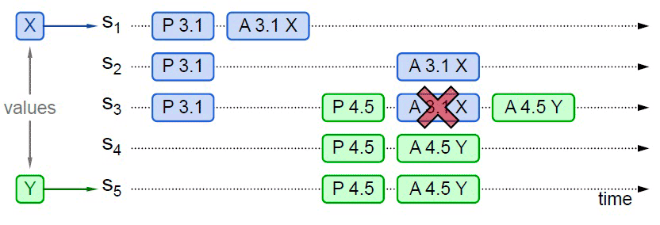

# 共识算法

## paxos协议
> Distributed Consensus Algorithm
> 
> There is only one consensus protocol, and that's “Paxos” — all other approaches are just broken versions of Paxos
> 
> 世界上只有一种共识协议，就是 Paxos，其他所有共识算法都是 Paxos 的退化版本。

Paxos 是由Leslie Lamport（就是大名鼎鼎的LaTeX中的“La”）提出的一种基于消息传递的协商共识算法，现已是当今分布式系统最重要的理论基础，几乎就是“共识”二字的代名词。如果没有 Paxos，那后续的 Raft、ZAB 等算法，ZooKeeper、Etcd 这些分布式协调框架、Hadoop、Consul 这些在此基础上的各类分布式应用都很可能会延后好几年面世。

Paxos 算法（在本小节中 Paxos 均特指最早的 Basic Paxos 算法）。Paxos 算法将分布式系统中的节点分为三类：

+ 提案节点：称为 Proposer，提出对某个值进行设置操作的节点，设置值这个行为就被称之为`提案（Proposal）`，值一旦设置成功，就是不会丢失也不可变的。请注意，Paxos 是典型的基于操作转移模型而非状态转移模型来设计的算法，这里的“设置值”不要类比成程序中变量赋值操作，应该类比成日志记录操作，在后面介绍的 Raft 算法中就直接把“提案”叫作“日志”了。
+ 决策节点：称为 Acceptor，是应答提案的节点，决定该提案是否可被投票、是否可被接受。提案一旦得到过半数决策节点的接受，即称该提案被批准（Accept），提案被批准即意味着该值不能再被更改，也不会丢失，且最终所有节点都会接受该它。
+ 记录节点：被称为 Learner，不参与提案，也不参与决策，只是单纯地从提案、决策节点中学习已经达成共识的提案，譬如少数派节点从网络分区中恢复时，将会进入这种状态。

而在分布式的环境下，由于还要同时考虑到分布式系统内可能在任何时刻出现的通信故障，如果一个节点在取得锁之后，在释放锁之前发生崩溃失联，这将导致整个操作被无限期的等待所阻塞，因此算法中的加锁就不完全等同于并发控制中以互斥量来实现的加锁，还必须提供一个其他节点能抢占锁的机制，以避免因通信问题而出现死锁。

为了这个问题，分布式环境中的锁必须是可抢占的。**Paxos 算法包括两个阶段，其中，第一阶段“准备”（Prepare）就相当于上面抢占锁的过程**。如果某个提案节点准备发起提案，必须先向所有的决策节点广播一个许可申请（称为 Prepare 请求）。提案节点的 Prepare 请求中会附带一个全局唯一的数字 n 作为提案 ID，决策节点收到后，将会给予提案节点两个承诺与一个应答。

两个承诺是指：

承诺不会再接受提案 ID 小于或等于 n 的 Prepare 请求。
承诺不会再接受提案 ID 小于 n 的 Accept 请求。
一个应答是指：

不违背以前作出的承诺的前提下，回复已经批准过的提案中 ID 最大的那个提案所设定的值和提案 ID，如果该值从来没有被任何提案设定过，则返回空值。如果违反此前做出的承诺，即收到的提案 ID 并不是决策节点收到过的最大的，那允许直接对此 Prepare 请求不予理会。

当提案节点收到多数的派的应答后,就开始第二阶段的批准(Accept)阶段了,
+ 如果发现之前没有人来申请该值的变更,说明当前节点是第一个节点,设定当前选定的值和一个提案节点构成二元组,再次广播到全部的决策节点(**Accept请求**)
+ 如果发现所有的响应节点里面,至少有一个节点包含该值,那么它就不能随意取值了,而是要无条件的从响应的节点里面找到最大的提案ID的值,并构成二元组再次广播
到全部的决策节点.

当提案节点收到了多数派决策节点的应答（称为 Accepted 应答）后，协商结束，共识决议形成，将形成的决议发送给所有记录节点进行学习。整个过程的时序图如图 6-1 所示。

> 图 6-1 Paxos 算法整体时序图
> 

### 具体实践

假设一个分布式系统有五个节点，分别命名为 S1、S2、S3、S4、S5，这个例子中只讨论正常通信的场景，不涉及网络分区。全部节点都同时扮演着提案节点和决策节点的身份。此时，有两个并发的请求分别希望将同一个值分别设定为 X（由 S1作为提案节点提出）和 Y（由 S5作为提案节点提出），以 P 代表准备阶段，以 A 代表批准阶段，这时候可能发生以下情况：

#### 第一种情况
S1选定的提案 ID 是 3.1（全局唯一 ID 加上节点编号），先取得了多数派决策节点的 Promise 和 Accepted 应答，此时 S5选定提案 ID 是 4.5，发起 Prepare 请求，收到的多数派应答中至少会包含 1 个此前应答过 S1的决策节点

假设是 S3，那么 S3提供的 Promise 中必将包含 S1已设定好的值 X，S5就必须无条件地用 X 代替 Y 作为自己提案的值，由此整个系统对“取值为 X”这个事实达成一致，如图 6-2 所示。

>图 6-2 整个系统对“取值为 X”达成一致

#### 第二种情况 
当然，另外一种可能的结果是 S5提案时 Promise 应答中并未包含批准过 X 的决策节点，譬如应答 S5提案时，节点 S1已经批准了 X，节点 S2、S3未批准但返回了 Promise 应答，此时 S5以更大的提案 ID 获得了 S3、S4、S5的 Promise，这三个节点均未批准过任何值，那么 S3将不会再接收来自 S1的 Accept 请求，因为它的提案 ID 已经不是最大的了，这三个节点将批准 Y 的取值，整个系统最终会对“取值为 Y”达成一致，如图 6-4 所示。

>图 6-4 整个系统最终会对“取值为 Y”达成一致

从情况三可以推导出另一种极端的情况，如果两个提案节点交替使用更大的提案 ID 使得准备阶段成功，但是批准阶段失败的话，这个过程理论上可以无限持续下去，形成活锁（Live Lock），如图 6-5 所示。在算法实现中会引入随机超时时间来避免活锁的产生。

> 图 6-5 批准阶段失败，形成活锁

Basic Paxos 的价值在于开拓了分布式共识算法的发展思路，但它因有如下缺陷，一般不会直接用于实践：Basic Paxos 只能对单个值形成决议，并且决议的形成至少需要两次网络请求和应答（准备和批准阶段各一次），高并发情况下将产生较大的网络开销，极端情况下甚至可能形成活锁。

## 以multi paxos等价派生实现 raft 和ZAB 
活锁问题与许多 Basic Paxos 异常场景中所遭遇的麻烦，都可以看作是源于任何一个提案节点都能够完全平等地、与其他节点并发地提出提案而带来的复杂问题。

Multi Paxos 对 Basic Paxos 的核心改进是增加了“选主”的过程，提案节点会通过定时轮询（心跳），确定当前网络中的所有节点里是否存在有一个主提案节点

当选主成功后,只有主节点才能进行提案操作.无论哪个提案节点接收到客户端的操作请求，都会将请求转发给主节点来完成提案，而主节点提案的时候，也就无需再次经过准备过程，因为可以视作是经过选举时的那一次准备之后，后续的提案都是对相同提案 ID 的一连串的批准过程。

我们换一个角度来重新思考“分布式系统中如何对某个值达成一致”这个问题，可以把该问题划分做三个子问题来考虑，可以证明（具体证明就不列在这里了，感兴趣的读者可参考结尾给出的论文）当以下三个问题同时被解决时，即等价于达成共识：

**如何选主（Leader Election）。

如何把数据复制到各个节点上（Entity Replication）。

如何保证过程是安全的（Safety）。**

刚才已经说过了选主的流程 , 还涉及许多工程上的细节，譬如心跳、随机超时、并行竞选等等,接下来说说复制数据的问题

当客户端向主节点发起一个操作请求，譬如提出“将某个值设置为 X”，主节点首先将该值写入本地的日志里面(使用顺序写的方式) ,先不提交,把X变更的信息放入到
下次心跳里面广播给所有的节点,等到超过半数的节点发送已经写入变更日志后,并返回给主节点后,主节点认为该值已经记录下来,并进行提交.

在异常情况下，网络出现了分区，部分节点失联，但只要仍能正常工作的节点的数量能够满足多数派（过半数）的要求，分布式系统就仍然可以正常工作，这时候数据复制过程如下：

假设有 S1、S2、S3、S4、S5五个节点，S1是主节点，由于网络故障，导致 S1、S2和 S3、S4、S5之间彼此无法通信，形成网络分区。

一段时间后，S3、S4、S5三个节点中的某一个（譬如是 S3）最先达到心跳超时的阈值，获知当前分区中已经不存在主节点了，它向所有节点发出自己要竞选的广播，并收到了 S4、S5节点的批准响应，加上自己一共三票，即得到了多数派的批准，竞选成功，此时系统中同时存在 S1和 S3两个主节点，但由于网络分区，它们不会知道对方的存在。

这种情况下，客户端发起操作请求：

如果客户端连接到了 S1、S2之一，都将由 S1处理，但由于操作只能获得最多两个节点的响应，不构成多数派的批准，所以任何变更都无法成功提交。
如果客户端连接到了 S3、S4、S5之一，都将由 S3处理，此时操作可以获得最多三个节点的响应，构成多数派的批准，是有效的，变更可以被提交，即系统可以继续提供服务。
事实上，以上两种“如果”情景很少机会能够并存。网络分区是由于软、硬件或者网络故障而导致的，内部网络出现了分区，但两个分区仍然能分别与外部网络的客户端正常通信的情况甚为少见。更多的场景是算法能容忍网络里下线了一部分节点，按照这个例子来说，如果下线了两个节点，系统正常工作，下线了三个节点，那剩余的两个节点也不可能继续提供服务了。
假设现在故障恢复，分区解除，五个节点可以重新通信了：

S1和 S3都向所有节点发送心跳包，从各自的心跳中可以得知两个主节点里 S3的任期编号更大，它是最新的，此时五个节点均只承认 S3是唯一的主节点。
S1、S2回滚它们所有未被提交的变更。
S1、S2从主节点发送的心跳包中获得它们失联期间发生的所有变更，将变更提交写入本地磁盘。
此时分布式系统各节点的状态达成最终一致。

## Gossip协议
Paxos、Raft、ZAB 等分布式算法经常会被称作是“强一致性”的分布式共识协议

Gossip 最早由施乐公司出的一种用于分布式数据库在多节点间复制同步数据的算法。从论文题目中可以看出，最初它是被称作“流行病算法”

下面，我们来了解 Gossip 的具体工作过程。相比 Paxos、Raft 等算法，Gossip 的过程十分简单，它可以看作是以下两个步骤的简单循环：

+ 如果有某一项信息需要在整个网络中所有节点中传播，那从信息源开始，选择一个固定的传播周期（譬如 1 秒），随机选择它相连接的 k 个节点（称为 Fan-Out）来传播消息。

+ 每一个节点收到消息后，如果这个消息是它之前没有收到过的，将在下一个周期内，选择除了发送消息给它的那个节点外的其他相邻 k 个节点发送相同的消息，直到最终网络中所有节点都收到了消息，尽管这个过程需要一定时间，但是理论上最终网络的所有节点都会拥有相同的消息。

上图是 Gossip 传播过程的示意图，根据示意图和 Gossip 的过程描述，我们很容易发现 Gossip 对网络节点的连通性和稳定性几乎没有任何要求，它一开始就将网络某些节点只能与一部分节点部分连通（Partially Connected Network）而不是以全连通网络（Fully Connected Network）作为前提；能够容忍网络上节点的随意地增加或者减少，随意地宕机或者重启，新增加或者重启的节点的状态最终会与其他节点同步达成一致。

同时我们也很容易找到 Gossip 的缺点，消息最终是通过多个轮次的散播而到达全网的，因此它必然会存在全网各节点状态不一致的情况，而且由于是随机选取发送消息的节点，所以尽管可以在整体上测算出统计学意义上的传播速率，但对于个体消息来说，无法准确地预计到需要多长时间才能达成全网一致。另外一个缺点是消息的冗余，同样是由于随机选取发送消息的节点，也就不可避免的存在消息重复发送给同一节点的情况，增加了网络的传输的压力，也给消息节点带来额外的处理负载。

## 思考 
paxos 可以理解为 两步,第一步是申请锁(prepare) ,返回(promise),如果这个值没有被锁住则返回 , 如果被锁住则返回之前的节点信息.

申请到了锁,则开始提交数据(accept)

问题出在了,当提交数据的时候,锁已经释放完了.

所以会出现问题: 活锁或者两个数值X和Y有可能是X,还有可能是Y

raft和zab等 multi paxos 派生协议

是通过选主来解决数据有可能是x,也有可能是Y来解决
数据复制       使用的过半数顺序写入日志来解决问题.
过程安全等等来保证

