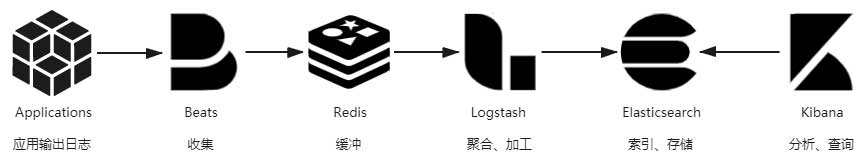

# 事件日志

日志用来记录系统运行期间发生过的离散事件。相信没有哪一个生产系统能够缺少日志功能，然而也很少人会把日志作为多么关键功能来看待。日志就像阳光与空气，无可或缺却不太被重视。程序员们会说日志简单，其实这是在说“打印日志”这个操作简单，打印日志的目的是为了日后从中得到有价值的信息，而今天只要稍微复杂点的系统，尤其是复杂的分布式系统，就很难只依靠 tail、grep、awk 来从日志中挖掘信息了，往往还要有专门的全局查询和可视化功能。此时，从打印日志到分析查询之间，还隔着收集、缓冲、聚合、加工、索引、存储等若干个步骤，如图 10-3 所示。

## 收集与缓冲

写日志是在服务节点中进行的，但我们不可能在每个节点都单独建设日志查询功能。这不是资源或工作量的问题，而是分布式系统处理一个请求要跨越多个服务节点，为了能看到跨节点的全部日志，就要有能覆盖整个链路的全局日志系统。这个需求决定了每个节点输出日志到文件后，必须将日志文件统一收集起来集中存储、索引，由此便催生了专门的日志收集器。

最初，ELK 中日志收集与下一节要讲的加工聚合的职责都是由 Logstash 来承担的，Logstash 除了部署在各个节点中作为收集的客户端（Shipper）以外，它还同时设有独立部署的节点，扮演归集转换日志的服务端（Master）角色。Logstash 有良好的插件化设计，收集、转换、输出都支持插件化定制，应对多重角色本身并没有什么困难。但是 Logstash 与它的插件是基于 JRuby 编写的，要跑在单独的 Java 虚拟机进程上，而且 Logstash 的默认的堆大小就到了 1GB。对于归集部分（Master）这种消耗并不是什么问题，但作为每个节点都要部署的日志收集器就显得太过负重了。后来，Elastic.co 公司将所有需要在服务节点中处理的工作整理成以Libbeat为核心的Beats 框架，并使用 Golang 重写了一个功能较少，却更轻量高效的日志收集器，这就是今天流行的Filebeat。

现在的 Beats 已经是一个很大的家族了，除了 Filebeat 外，Elastic.co 还提供有用于收集 Linux 审计数据的Auditbeat、用于无服务计算架构的Functionbeat、用于心跳检测的Heartbeat、用于聚合度量的Metricbeat、用于收集 Linux Systemd Journald 日志的Journalbeat、用于收集 Windows 事件日志的Winlogbeat，用于网络包嗅探的Packetbeat，等等，如果再算上大量由社区维护的Community Beats，那几乎是你能想像到的数据都可以被收集到，以至于 ELK 也可以一定程度上代替度量和追踪系统，实现它们的部分职能，这对于中小型分布式系统来说是便利的，但对于大型系统，笔者建议还是让专业的工具去做专业的事情。

日志收集器不仅要保证能覆盖全部数据来源，还要尽力保证日志数据的连续性，这其实并不容易做到。譬如淘宝这类大型的互联网系统，每天的日志量超过了 10,000TB（10PB）量级，日志收集器的部署实例数能到达百万量级（数据来源），此时归集到系统中的日志要与实际产生的日志保持绝对的一致性是非常困难的，也不应该为此付出过高成本。换而言之，日志不追求绝对的完整精确，只追求在代价可承受的范围内保证尽可能地保证较高的数据质量。一种最常用的缓解压力的做法是将日志接收者从 Logstash 和 Elasticsearch 转移至抗压能力更强的队列缓存，譬如在 Logstash 之前架设一个 Kafka 或者 Redis 作为缓冲层，面对突发流量，Logstash 或 Elasticsearch 处理能力出现瓶颈时自动削峰填谷，甚至当它们短时间停顿，也不会丢失日志数据。

## 加工与聚合
Logstash 的基本职能是把日志行中的非结构化数据，通过 Grok 表达式语法转换为上面表格那样的结构化数据，进行结构化的同时，还可能会根据需要，调用其他插件来完成时间处理（统一时间格式）、类型转换（如字符串、数值的转换）、查询归类（譬如将 IP 地址根据地理信息库按省市归类）等额外处理工作，然后以 JSON 格式输出到 Elasticsearch 中（这是最普遍的输出形式，Logstash 输出也有很多插件可以具体定制不同的格式）。有了这些经过 Logstash 转换，已经结构化的日志，Elasticsearch 便可针对不同的数据项来建立索引，进行条件查询、统计、聚合等操作的了。

## 存储与查询
经过收集、缓冲、加工、聚合的日志数据，终于可以放入 Elasticsearch 中索引存储了。Elasticsearch 是整个 Elastic Stack 技术栈的核心，其他步骤的工具，如 Filebeat、Logstash、Kibana 都有替代品，有自由选择的余地，唯独 Elasticsearch 在日志分析这方面完全没有什么值得一提的竞争者，几乎就是解决此问题的唯一答案。这样的结果肯定与 Elasticsearch 本身是一款优秀产品有关，然而更关键的是 Elasticsearch 的优势正好与日志分析的需求完美契合：

